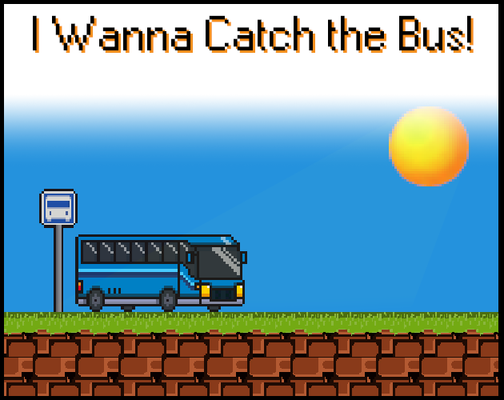
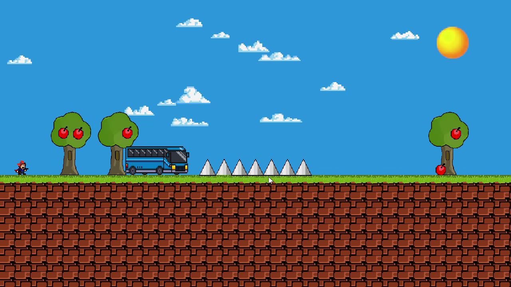
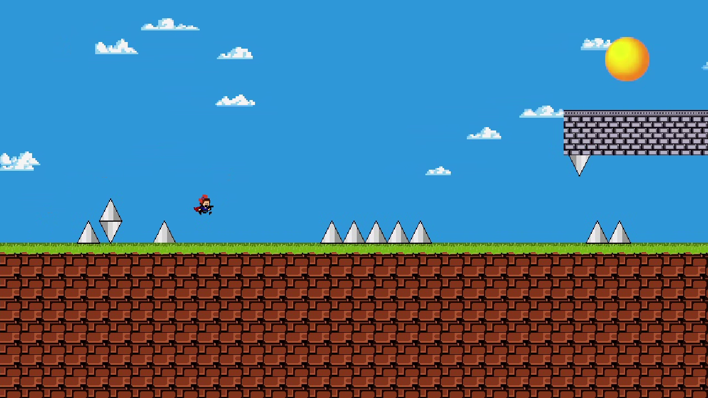
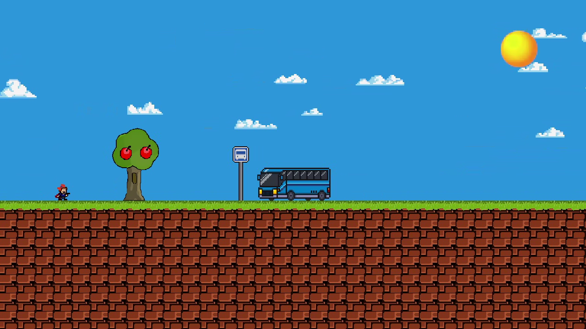

# 🚌 I Wanna Catch the Bus! / Chyť autobus!

  

## 🎯 Cíl projektu
Cílem ročníkového projektu bylo vytvořit vlastní 2D plošinovou hru inspirovanou titulem *I Wanna Be The Guy*, která kombinuje vysokou obtížnost a zábavnou prezentaci. Hráč se snaží doběhnout na zastávku a chytit autobus přes sérii nástrah a přesných skoků.  
Projekt jsem vytvořil samostatně a od nuly.

## 🔧 Jak spustit
- Ve složce **Build** se nachází sestavená hra.
- Pro spuštění stačí otevřít soubor **.exe** (např. `nazev_projektu.exe`).
- Není nutné nic instalovat – hra běží přímo.

## 🧪 Zdrojový kód
- Nachází se ve složce **Assets**.
- Obsahuje všechny **Unity Assety**, skripty, scény, materiály a prefaby.
- Projekt lze otevřít pomocí **Unity Hub** (doporučená verze je `Unity 2022.3.61f1` nebo novější).

## 🧠 Současný stav
- Hra má funkční jádro – pohyb postavy, kolize, respawn, checkpointy, nástrahy, funkční menu.
- Je možné ji dohrát od začátku do konce.
- Základní obrazovky: hlavní menu -> 3x levely -> konec.
- Vizuálně a designově připomíná styl I Wanna Be The Guy.
- Projekt byl vyvíjen samostatně. Mám předchozí zkušenosti s Unity 2D i 3D, ale i tak bylo náročné ladit některé chyby.
- Při vývoji jsem využíval AI (ChatGPT) ke **diagnostice chyb a návrhu jejich řešení**, případně optimalizaci kódu.
- Většina nástrojů, systémů a skriptů pro základní fungování hry je již hotová.
- Hra je nyní plně připravená k rozšiřování – lze snadno přidávat nové úrovně, pasti a herní prvky.

- Největší problémy při vývoji:
  - Bugy s kolizí a resetem checkpointů
  - Celková optimalizace
  - UI scaling
- Vylepšení do budoucna:
  - Lokalizace do češtiny i angličtiny
  - Hudba do pozadí
  - Více druhů pastí
  - Více levelů

### 📸 Fotodokumentace

  
  
  

## 🎥 Video prezentace

### [Zde je celé video:](https://youtu.be/KHIzCDovQJI)

### 📝 Použité technologie a nástroje
- **Engine:** Unity 2022.3.61f1 (2D - Universal Render Pipeline *URP*)
- **Jazyk:** C# (Visual Studio 2020)
- **Grafika:** Aseprite, Photoshop
- **Zvuk:** Audacity
- **Video/editace:** DaVinci Resolve

### 📦 Použité assety
- Většina assetů pochází z [Sprites-Resources.com](https://www.spriters-resource.com/)
- Mix zvuků a efektů pochází z [Sounds-Resources.com](https://www.sounds-resource.com/)
- Reference pro assety pochází z [Pinterest.com](https://cz.pinterest.com/)

## 💻 Použitý hardware
- **Procesor:** AMD Ryzen 7 7800X3D  
- **Základní deska:** MSI MAG B650 TOMAHAWK WIFI  
- **Paměť:** 32 GB DDR5 6000MHz CL36 Kingston FURY Beast RGB  
- **SSD:** Kingston FURY Renegade NVMe 2TB  
- **Grafická karta:** SAPPHIRE NITRO+ AMD Radeon RX 7900 XT Vapor-X 20G  
- **Chladič:** Endorfy Fortis 5 Dual Fan  
- **Zdroj:** ADATA XPG Core Reactor Gold 850W  
- **Skříň:** NZXT H5 Flow RGB  
- **OS:** Windows 11
- **Monitor:** Dell Alienware AW2723DF

## 🙏 Poděkování
Děkuji **ChatGPT** za pomoc při odhalování a řešení chyb v kódu během vývoje.

## 📚 Citace a použité zdroje
- (1) SPRITERS RESOURCE. The Spriters Resource. Online. © 2025. Dostupné z: https://www.spriters-resource.com/. [cit. 2025-05-17].
- (2) SOUNDS RESOURCE. The Sounds Resource. Online. © 2025. Dostupné z: https://www.sounds-resource.com/. [cit. 2025-05-17].
- (3) PINTEREST. Pinterest. Online. © 2025. Dostupné z: https://www.pinterest.com/. [cit. 2025-05-17].
- (4) UNITY TECHNOLOGIES. Unity Learn. Online. © 2025. Dostupné z: https://learn.unity.com/. [cit. 2025-05-17].
- (5) OPENAI. ChatGPT. Online. © 2025. Dostupné z: https://chat.openai.com/. [cit. 2025-05-17].
- (6) UNITY TECHNOLOGIES. Unity Documentation. Online. © 2025. Dostupné z: https://docs.unity3d.com/. [cit. 2025-05-17].
- (7) UNITY TECHNOLOGIES. Unity Asset Store. Online. © 2025. Dostupné z: https://assetstore.unity.com/. [cit. 2025-05-17].

## 📖 Doporučená literatura
- [1] UNITY TECHNOLOGIES. Unity Learn Tutorials. Online. © 2025. Dostupné z: https://learn.unity.com/. [cit. 2025-05-17].
- [2] UNITY TECHNOLOGIES. Oficiální dokumentace Unity. Online. © 2025. Dostupné z: https://docs.unity3d.com/. [cit. 2025-05-17].
- [3] YouTube kanály: Brackeys, Code Monkey, Game Dev Guide. [cit. 2025-05-17].

## ⚖️ Licence
Tento projekt je vytvořen pro školní účely a není určen k veřejné distribuci. Veškeré použité assety podléhají licencím svých původních autorů.
